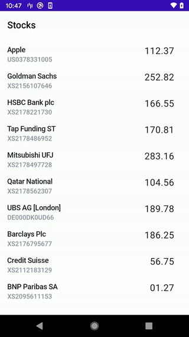

# Stocks
This is an Android app to showcase a data streaming of the stock market via a WebSocket

### Tech stack
- WebSocket (OkHttp)
- MVVM
- RxJava2
- LiveData
- Dagger2
- Navigation component
- MockK for testing
- Kotlin
- Ktlint for static code analysis (used from terminal)

